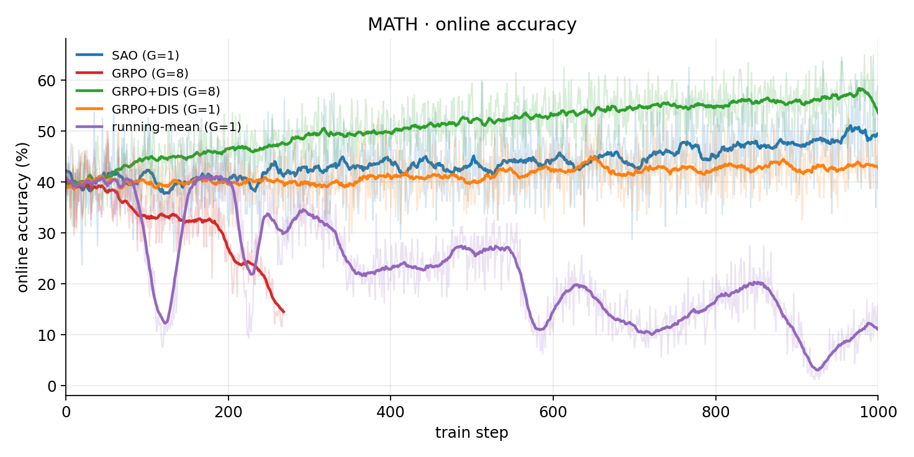
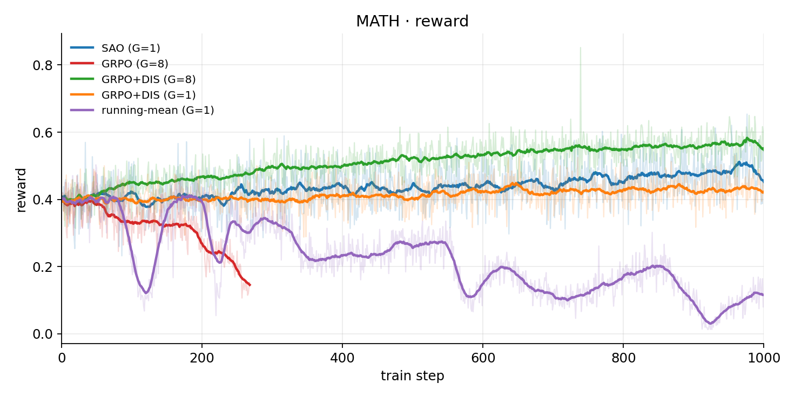

# Single-rollout Asynchronous Optimization

**Unofficial** community re-implementation of **SAO** (*Single-rollout Asynchronous Optimization*, [arXiv:2607.07508](https://arxiv.org/abs/2607.07508)).  
Not affiliated with or endorsed by the paper authors.

Built on [AReaL](https://github.com/inclusionAI/AReaL). This repository packages algorithm helpers, training configs, an AReaL integration patch, launch/monitor tooling, and MATH experiment results.

## Features

- **SAO**: single-rollout (G=1) + critic (K=2) + **DIS** + skip-obs GAE — helpers in [`sao/`](sao/)
- **Baselines**: GRPO, GRPO+DIS (G=8 / G=1), running-mean — configs in [`configs/`](configs/)
- **AReaL integration**: [`patches/areal-sao.patch`](patches/areal-sao.patch) (DIS metrics, running-mean norm, critic K, sharded reward)
- **Math RLVR**: [`scripts/prepare_math.py`](scripts/prepare_math.py) turns MATH into GSM8K-style schema; verify `\boxed{}` answers
- **Ops**: [`scripts/preflight_gpus.sh`](scripts/preflight_gpus.sh), [`scripts/reward_workers_ctl.py`](scripts/reward_workers_ctl.py), [`scripts/monitor.py`](scripts/monitor.py)

## Method

| Component | Setting |
|-----------|---------|
| Rollout | 1 sample per prompt (SAO) |
| Critic | value model, K=2 updates (`SAO_CRITIC_K`) |
| DIS | mask tokens outside ratio band `[0.3, 5.0]` — [`sao/dis.py`](sao/dis.py) |
| Advantage | skip-obs GAE — [`sao/gae.py`](sao/gae.py) |

## Quick start

```bash
# 1) env
cp .env.example .env   # fill SAO_WS / MODEL_ROOT / REWARD_ROOT / ADMIN_API_KEY
set -a; source .env; set +a
export SAO_WS=${SAO_WS:-$PWD}

# 2) unit tests (no GPU; needs torch)
pip install -e '.[dev]'
pytest -q

# 3) AReaL @ pinned commit + SAO patch
#    clone-only (patch check):
bash scripts/bootstrap_areal.sh
#    training needs the AReaL venv (CUDA + vLLM/SGLang):
# INSTALL=1 INFERENCE_BACKEND=vllm bash scripts/bootstrap_areal.sh
#    optional mirror: AREAL_REPO=<git-url> bash scripts/bootstrap_areal.sh
export AREAL_ROOT=$PWD/vendor/AReaL
export PYTHONPATH=$AREAL_ROOT:$PWD

# 4) MATH data → GSM8K-style schema for AReaL
pip install '.[data]'
python scripts/prepare_math.py --output $SAO_WS/data/gsm8k_hard

# 5) one setting / all settings  (requires step 3 with INSTALL=1)
bash scripts/launch_experiment.sh configs/phase2_hard_sao.yaml
# bash scripts/launch_phase2_hard_compare.sh

# 6) monitor
bash scripts/start_monitor.sh   # http://127.0.0.1:8790/
```

Scripts used above: [`.env.example`](.env.example), [`scripts/bootstrap_areal.sh`](scripts/bootstrap_areal.sh), [`scripts/prepare_math.py`](scripts/prepare_math.py), [`scripts/launch_experiment.sh`](scripts/launch_experiment.sh), [`scripts/launch_phase2_hard_compare.sh`](scripts/launch_phase2_hard_compare.sh), [`scripts/start_monitor.sh`](scripts/start_monitor.sh).  
Example config: [`configs/phase2_hard_sao.yaml`](configs/phase2_hard_sao.yaml).

Hard configs assume a 3×8 GPU Ray cluster and optional sharded reward workers on SSH hosts `worker-0` / `worker-1` (role aliases — edit `reward.fs_shard.workers` or set `reward.backend: local` for single-node).

Dataset: [MATH](https://github.com/hendrycks/math) ([arXiv:2103.03874](https://arxiv.org/abs/2103.03874); Hub [`DigitalLearningGmbH/MATH-lighteval`](https://huggingface.co/datasets/DigitalLearningGmbH/MATH-lighteval)).  
Model used in reported runs: [`Qwen3-4B-Instruct-2507`](https://huggingface.co/Qwen/Qwen3-4B-Instruct-2507).  
Full writeup: [docs/20260725-math-hard-report.md](docs/20260725-math-hard-report.md).

## Experiments

MATH train (~7.5k) · `total_train_steps=1000` · online `acc = correct/(correct+incorrect)`.

### Design

Same data, model, and topology. Only the **algorithm factors** change, so each row answers one question:

| Setting | Role in the design | What it isolates |
|---------|--------------------|------------------|
| [**SAO**](configs/phase2_hard_sao.yaml) | Method **from the paper** | Full recipe: G=1 + critic (K=2) + DIS + skip-obs GAE |
| [**GRPO**](configs/phase2_hard_grpo.yaml) | **Control** | Strong group-relative baseline (G=8), no critic, no DIS |
| [**GRPO+DIS**](configs/phase2_hard_grpo_dis.yaml) | **Control + DIS** ablation | Add only DIS on top of GRPO → is DIS the stabilizer? |
| [**running-mean**](configs/phase2_hard_running_mean.yaml) | **Single-traj baseline** ablation | G=1, no critic, no DIS; only a running-mean reward baseline → does a non-group baseline alone save G=1? |
| [**single-traj + DIS**](configs/phase2_hard_grpo_dis_g1.yaml) | **Same-budget** ablation vs SAO | G=1 + DIS, no critic (batch reward norm) → under equal trajectory budget, how much does critic still matter? |

`single-traj + DIS` is **not** GRPO: group-relative advantage needs G≥2. Config filename may still say `grpo_dis_g1` for path compatibility only. Orchestration: [`scripts/launch_phase2_hard_compare.sh`](scripts/launch_phase2_hard_compare.sh).

### Numbers

| Setting | Role | G | Critic | DIS | Steps | Acc (start → end) |
|---------|------|---|--------|-----|-------|-------------------|
| **SAO** | from paper | 1 | ✓ | ✓ | 1000 | ~40% → **~49%** |
| **GRPO** | control | 8 | — | — | 268† | ~39% → **~15%** |
| **GRPO+DIS** | control + DIS | 8 | — | ✓ | 1000 | ~40% → **~57%** |
| **running-mean** | single-traj baseline | 1 | — | — | 1000 | ~40% → **~10%** |
| **single-traj + DIS** | same-budget vs SAO | 1 | — | ✓ | 1000 | ~40% → **~43%** |

† GRPO early-stop after collapse. End windows: **951–1000** (GRPO: **251–268**). Details: [docs/20260725-math-hard-report.md](docs/20260725-math-hard-report.md).

### Curves





### Results

- **DIS is the stabilizer on the control**: GRPO collapses (~15%@268); GRPO+DIS holds and rises (~57%@1000).
- **Under the same G=1 budget**: SAO (~49%) > single-traj+DIS (~43%) ≫ running-mean (~10%) — DIS helps without a group, but does not replace the critic.
- **Highest absolute online score** is GRPO+DIS (~57%), which spends **8×** trajectories per step vs G=1 settings; compare G=8 and G=1 separately.

## Repository layout

| Path | Contents |
|------|----------|
| [`sao/`](sao/) | DIS / loss / GAE / critic loop / log metrics |
| [`configs/`](configs/) | experiment yaml (paths via env placeholders) |
| [`patches/areal-sao.patch`](patches/areal-sao.patch) | apply to pinned AReaL |
| [`areal-hooks/`](areal-hooks/) | reference excerpts + DIS tests |
| [`scripts/`](scripts/) | bootstrap / prepare / launch / monitor / reward ctl |
| [`tests/`](tests/) | unit + config + metrics tests |
| [`docs/`](docs/) | [MATH-hard report](docs/20260725-math-hard-report.md) · [figures](docs/figures/) |

## Q&A — issues we hit and how this repo addresses them

### Q1. Reward timeouts / training wall-clock blows up

**Symptom.** `RewardAPI … timeout`, `timeperf/rollout` jumps from tens of seconds to minutes; GPU util looks “low” because the step window is padded with CPU wait.

**Cause.** Local `math_verify` ProcessPool was colocated with rollout/RPC on the head node, while train nodes’ CPUs sat idle.

**Fix in this repo.** Sharded file-based reward (`reward.backend: fs_shard`) + [`scripts/reward_workers_ctl.py`](scripts/reward_workers_ctl.py). Launch via [`scripts/launch_experiment.sh`](scripts/launch_experiment.sh) starts/stops workers when the yaml uses `fs_shard`.

### Q2. Host RAM OOM mid-run (Ray kills a worker)

**Symptom.** Ray `OutOfMemoryError` / sudden worker death; often during weight sync or long vLLM residency—not necessarily CUDA OOM.

**Cause.** Head or train-node host RAM hits Ray’s memory threshold (~0.98). Peak RSS moves between rollout engines and disk weight-update serialization.

**Fix in this repo.** Prefer `weight_update_mode: disk` in the shipped hard configs; use [`scripts/preflight_gpus.sh`](scripts/preflight_gpus.sh) before launch. See figure [docs/figures/topo-oom-stages.svg](docs/figures/topo-oom-stages.svg).

### Q3. Ghost / zombie GPU VRAM (memory full, no process)

**Symptom.** `nvidia-smi` shows high `memory.used` but Processes empty / `[Not Found]`.

**Cause.** Hard-killing GPU processes (`kill -9`, `ray stop --force`) leaves orphaned CUDA contexts. Container `gpu-reset` often cannot clear them.

**Fix in this repo.** [`scripts/preflight_gpus.sh`](scripts/preflight_gpus.sh) rejects dirty GPUs; launch paths stop Ray with grace (no `--force`). Bypass dirty cards with `CUDA_VISIBLE_DEVICES` / change nodes; only platform reboot clears true zombies.

### Q4. Sharded reward workers die and training hangs

**Symptom.** Heartbeat stale; train stuck after hundreds of steps; worker PID gone.

**Cause.** `BrokenProcessPool` drain path cleared `_inflight` then `pop`’d a sibling Future → coordinator `KeyError` exit; no supervisor.

**Fix in this repo.** Patch ([`patches/areal-sao.patch`](patches/areal-sao.patch)) includes the safe `_drain_done` (`pop(..., None)`); [`scripts/reward_workers_ctl.py`](scripts/reward_workers_ctl.py) wraps workers with respawn + optional `watch`.

### Q5. How do I monitor accuracy / reward / health?

```bash
bash scripts/start_monitor.sh          # http://127.0.0.1:8790/
# or parse logs only:
python -c "from sao.metrics import collect_metrics; print(collect_metrics('logs'))"
```

See [`scripts/start_monitor.sh`](scripts/start_monitor.sh) and [`sao/metrics.py`](sao/metrics.py). The monitor reads local `logs/*.log`, plots online acc / reward, and flags OOM / NaN / completion.

### Q6. Is G=1 + DIS still “GRPO”?

No. Group-relative advantage needs **G≥2**. The **single-traj + DIS** row ([`configs/phase2_hard_grpo_dis_g1.yaml`](configs/phase2_hard_grpo_dis_g1.yaml)) is a same-budget ablation vs SAO (DIS without critic); do not call it GRPO.

## License

Apache License 2.0 — see [LICENSE](LICENSE) and [NOTICE](NOTICE).
